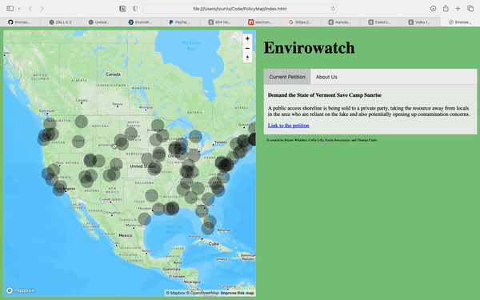

<center># PolicyMap</center>


<h1 align="center">
  <br>
  </a>
  <br>
  PolicyMap
  <br>
</h1>

<h4 align="center">A webpage that allows people to directly impact issues on a national scale.<br><a href="https://devpost.com/software/envirowatch-pjauc6" target="_blank">DevPost</a>.</h4>

<p align="center">
  <a href="#Inspiration">Inspiration</a> •
  <a href="#What-it-does">What it Does</a> •
  <a href="#How-we-build-it">How we build it</a> •
  <a href="#How-to-use">How to use</a> •
  <a href="#Team-Members">Team Members</a> 

</p>



## Inspiration

<p> We were inspired by the sustainability track and the idea that we could create a webpage that would allow people to directly impact issues on a national scale. We wanted to allow everyone the ability to create a positive change and we thought an interactive map would be a fun and easy-to-use way to accomplish that goal. </p>

## What it does
<p> This project accesses a data file containing a variety of environmentally unfriendly projects and policies across the United States and displays them on an interactive map where users can click on individual pins to see more information and access petitions about the specific cause <p>

 ## How we build it

 <p> We used the Mapbox API with Mapbox GL JS to help us design the layout of the interactive map and filled a GEOJSON file with various data points that we researched on the website Change.org. We used some HTML, CSS, and JavaScript to create an appealing-looking webpage to host the map, data, and some information about our mission. </p>


## How to use

To clone this repository, you'll need [Git](https://git-scm.com). Open index.html file in web browser 

```bash
# Clone this repository
$ git clone https://github.com/thomasvcurtis/PolicyMap

```

> **Note:**
> If you're using Linux Bash for Windows, [see this guide](https://www.howtogeek.com/261575/how-to-run-graphical-linux-desktop-applications-from-windows-10s-bash-shell/) or use `node` from the command prompt.


## Team Members

Bryant Whitaker <br>
Colby Lilly  <br>
Kayla Senczyszyn <br>
Thomas Curtis
